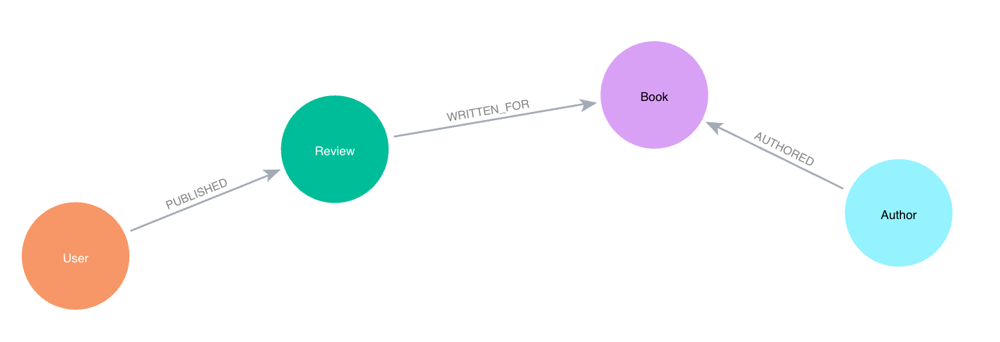

= Spring AI application with Spring Data Neo4j

This is an example application using Spring AI, Spring Data Neo4j, Neo4j (utilizing both vector search and graph search capabilities), and Goodreads book data.

== Data set

Data is maintained and pulled from a public data source. Load scripts and more information is available in https://github.com/JMHReif/graph-demo-datasets/tree/main/goodreadsUCSD[this data set Github repository^]. An example of the data model is shown below.



For this project, we are focusing on the Book and Review entities and the relationship between them.

== Notes

There were a few "gotchas" I found as I built this application.

1. Create a specific `Neo4jVectorStore` bean, even though the integration test in the https://neo4j.com/labs/genai-ecosystem/spring-ai/[guide^] shows a generic VectorStore one.
2. Spring AI with Neo4j requires a vector index name of `spring-ai-document-index`. There is a https://github.com/spring-projects/spring-ai/pull/301[pull request^] to allow custom configuration of the index name, but it is not yet merged (as of Feb 9, 2024).
3. Spring AI requires property names of `id` and `text` to return in the list of Documents from the similaritySearch method (no matter what label is configured for the Neo4jVectorStore bean). If your properties are named something else, the Spring app cannot map them from the Neo4j node to the expected Document object. You can refactor the data in Neo4j to change the property names to `id` and `text`.

== Running and testing this project

To run the application, you will need the following:

* Neo4j database credentials. You can set these in the `application.properties` file or as environment variables on the machine.
* OpenAI API key: they offer a free tier that works for this.

Once that's set up, execute the application with `./mvnw spring-boot:run`.

You can test a few different things. The `/hello` endpoint only sends the question to the LLM as a test. The `/rag` endpoint goes to Neo4j before forwarding the returned graph data to the LLM for formatting the response. The `/llm` endpoint only sends the prompt to the LLM, and the `/vector` only retrieves reviews from the vector search in Neo4j. Here are some ideas for values to test the `/rag` endpoint:

```
http ":8080/rag?searchPhrase=happy%20ending"

http ":8080/rag?searchPhrase=encouragement"

http ":8080/rag?searchPhrase=high%tech"

http ":8080/rag?searchPhrase=caffeine"
```

*Note:* The above commands are using the https://httpie.io/[
HTTPie^] command line tool, but you can use `curl` similarly.

== Presentation

PDF versions of accompanying presentations are published to SpeakerDeck.

* https://speakerdeck.com/jmhreif/hallucination-free-zone-llms-plus-graph-databases-got-your-back[ACM Chicago (Feb 2024)^]
* https://speakerdeck.com/jmhreif/improved-results-with-vector-search-in-knowledge-graphs[Data Science KC (Feb 2024)^]

== Resources
* Site: https://dev.neo4j.com/aura-java[Neo4j Aura^]
* Documentation: https://docs.spring.io/spring-ai/reference/api/vectordbs/neo4j.html[Spring AI Neo4j Vector Store^]
* Guide: https://neo4j.com/labs/genai-ecosystem/spring-ai[Spring AI Neo4j^]
* Online training: https://graphacademy.neo4j.com/categories/llms/[GraphAcademy LLM courses^]
* Documentation: https://platform.openai.com/docs/guides/embeddings[OpenAI Embeddings^]
